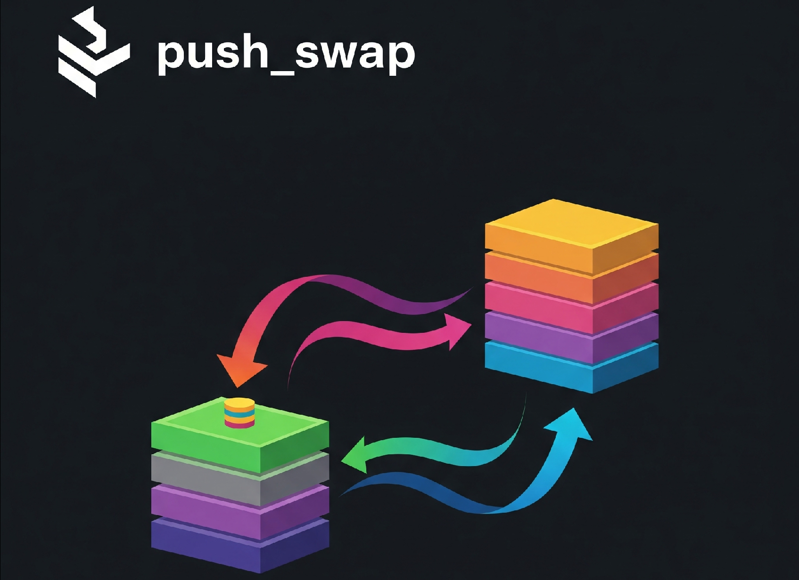
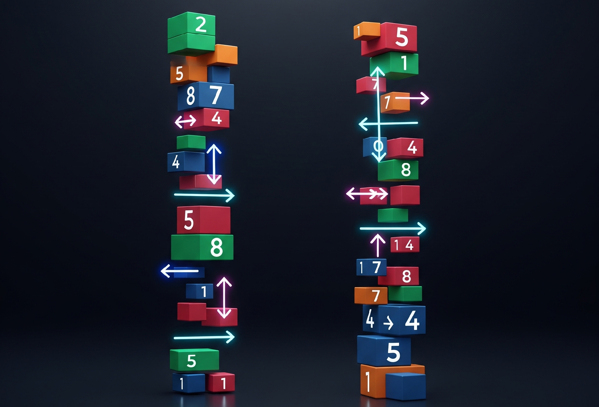
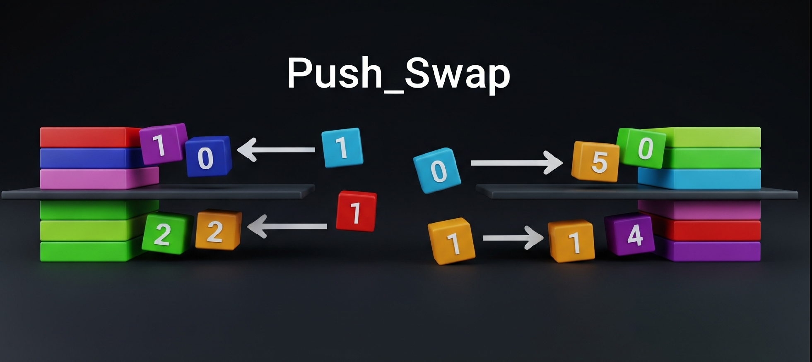

> Because Swap_push doesn’t feel as natural.

## 📖 Overview

**Push_swap** is a sorting algorithm challenge written in C. The goal is to sort a stack of integers using a limited set of stack operations, while minimizing the number of moves.

This project serves as a deep dive into sorting algorithms, data structure manipulation, algorithmic complexity, and C programming best practices.  
I completed both the **mandatory** and **bonus parts** of this project.

---

## 📌 Project Objectives

- Implement an efficient sorting algorithm using stack-based operations.
- Understand and optimize algorithmic complexity.
- Manage memory safely and according to 42's Norm.
- Explore concepts relevant to technical interviews and systems programming.

---

## 📑 Project Structure

- **push_swap**: The main program that generates the optimal sorting instructions.
- **checker**: A bonus program that verifies whether a given set of instructions successfully sorts the stack.

---

## 📚 Rules & Available Operations

You have **2 stacks: `a` and `b`**.  
The goal is to sort numbers in **stack `a`** in ascending order using the following operations:

| Operation | Description |
|:------------|:------------------------------------------------|
| `sa` | Swap the first 2 elements of stack a |
| `sb` | Swap the first 2 elements of stack b |
| `ss` | `sa` and `sb` at the same time |
| `pa` | Push the first element from `b` to `a` |
| `pb` | Push the first element from `a` to `b` |
| `ra` | Rotate stack `a` up by 1 |
| `rb` | Rotate stack `b` up by 1 |
| `rr` | `ra` and `rb` at the same time |
| `rra` | Reverse rotate stack `a` down by 1 |
| `rrb` | Reverse rotate stack `b` down by 1 |
| `rrr` | `rra` and `rrb` at the same time |


---

## 🖥️ Getting started!

### Cloning into your device
```bash
git clone https://github.com/husaltam/push_swap.git push_swap
cd push_swap
```

### 📦 Compiling

```bash
make
make bonus
```


### 📂 Running `push_swap`
As a requirement of the project, no repeated numbers are allowed as input!
```bash
./push_swap <list of integers>
```

**Example:**
```bash
./push_swap 2 1 3 6 5 8
```

Program will output a set of moves that if applied to this first stack and using another empty stack, we will end up with a fully sorted list:

```
pb
pb
rb
pb
sa
pa
pa
pa
```

---

### 📂 Running `checker` (Bonus) -> Second part of the project

The `checker` program reads instructions from standard input and applies them to a stack created from given arguments — i.e., it can take whatever the push_swap program has given to us then apply these moves to verify the final sorted list.

## First usage: make sure that a given instruction will end up sorting the given list arguments 

**Example:**
```bash
./checker 3 2 1 0
```

Then input instructions, e.g.:

```
pb
pb
sa
pa
pa
```
Then make sure to hit `Ctrl + D` for EOF signal to end the input stream.

If sorted correctly, it outputs:

```
OK
```

Otherwise:

```
KO
```

For invalid input:

```
Error
```

---

## Other usage example of the checker file: Why not take the list of our instructions through `./push_swap` then pipe these results to `./checker`? Smart, isn't it?

```bash
ARG="2 1 5 6 8"; ./push_swap $ARG | ./checker $ARG
```

**Result:**
```bash
OK!
1 2 3 5 6 8
```

---

## 📝 Benchmark Requirements

To validate your implementation:

- **100 random numbers** sorted in **< 700 operations**.
- **500 random numbers** sorted in **< 5500 operations**.

I successfully met both benchmarks.

---

## 📃 Makefile Rules

| Command       | Description                        |
|:--------------|:------------------------------------|
| `make`        | Compiles the mandatory program       |
| `make bonus`  | Compiles the bonus program           |
| `make clean`  | Removes object files                 |
| `make fclean` | Removes object files and executables |
| `make re`     | Recompiles the project               |

---

## 📂 Project Files

```
📦 push_swap/
 ┣ 📜 Makefile
 ┣ 📂 src/
 ┃ ┣ 📜 push_swap.c
 ┃ ┣ 📜 checker.c (bonus)
 ┃ ┗ 📜 ...
 ┣ 📂 include/
 ┃ ┣ 📜 push_swap.h
 ┃ ┗ 📜 ...
 ┣ 📂 libft/
 ┃ ┣ 📜 Makefile
 ┃ ┗ 📜 ...
 ┣ 📜 README.md
```

---

## 📖 Learning Outcomes

- Deepened understanding of algorithmic optimization and data structures.
- Gained experience managing memory safely in C.
- Improved familiarity with Makefiles, modular C code, and project structuring.
- Applied algorithmic complexity analysis to practical problems.

---

## 📎 Reference

- 📚 [42 Push_swap Subject](https://en.wikipedia.org/wiki/Stack_(abstract_data_type))
- 📚 [Sorting Algorithm Complexity](https://en.wikipedia.org/wiki/Analysis_of_algorithms)

---

## 🎉 Completion

✅ **Mandatory part**: Completed  
✅ **Bonus part**: Completed  

---

> *Project developed for 42 programming school.*

